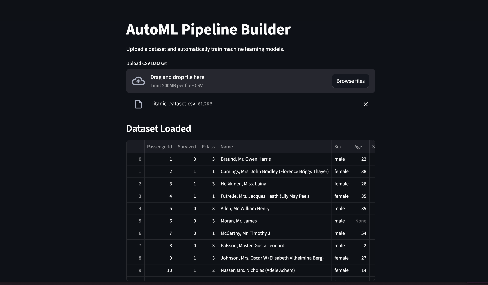
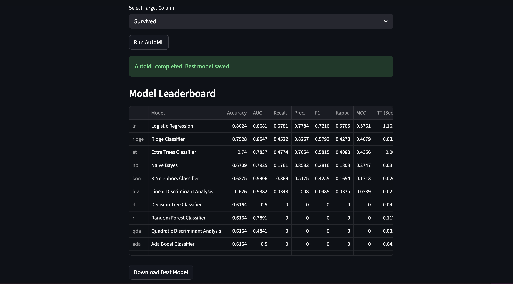

# AutoML Pipeline Builder

An interactive web application that automatically trains and compares machine learning models using PyCaret.
An interactive machine learning application that automatically trains and compares models using PyCaret and allows users to download the best model.

## Application Preview

## Features

* Upload any CSV dataset
* Select target column for prediction
* Automatic preprocessing and feature handling
* Train multiple ML models automatically
* Compare models and select the best one
* Export trained model

## Tech Stack

* Python
* Streamlit
* PyCaret
* Scikit-learn
* Pandas

## Project Structure

automl-pipeline-builder
│
├── app.py → Streamlit UI
├── automl_pipeline.py → AutoML training pipeline
├── requirements.txt
├── README.md
│
├── data/
│ └── sample_dataset.csv
│
└── models/
└── best_model.pkl

## How to Run

Clone the repository

git clone https://github.com/Kritisaha19/automl-pipeline-builder.git

Install dependencies

pip install -r requirements.txt

Run the application

streamlit run app.py

## Example Workflow

1. Upload dataset
2. Select target column
3. Run AutoML
4. View model comparison
5. Download the best trained model

## Future Improvements

* Model leaderboard visualization
* Hyperparameter tuning
* Deployment pipeline
* Support for regression tasks

## Author

Kriti Saha
